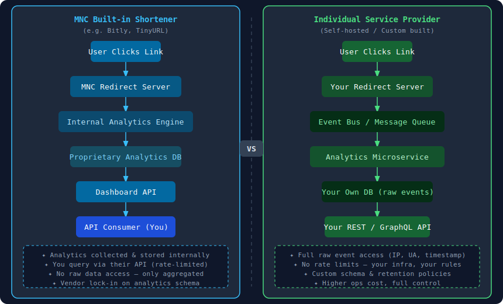
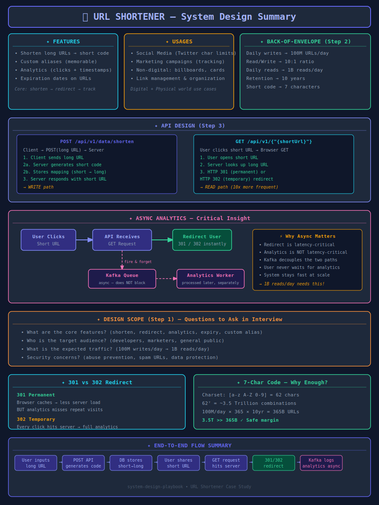

# THE URL SHORTNER
## Introduction
The URL shortener is a web application OR A mechanism that allows users to
 shorten long URLs into more manageable and short url
## Features
- Shorten long URLs: Users can input a long URL and receive a shortened version that redirects
- Custom aliases: Users can choose custom aliases for their shortened URLs, making them more memorable and easier to share.
- Analytics: The application can provide analytics on the usage of shortened URLs, such as the number visited data with timestamps
- Expiration: Users can set expiration dates for their shortened URLs, after which they will no longer be accessible.
## Usages
- Social Media: Users can share shortened URLs on social media platforms where character limits exist, such as Twitter.
- Marketing: Businesses can use URL shorteners in their marketing campaigns to track the effectiveness of their
- Non Digital marketing  like billboard,visiting cards,  newspapers 
- Link Management: Individuals and organizations can use URL shorteners to manage and organize their links more efficiently.

## Analytics: MNC Built-in Shortener vs Individual Service Provider

---

## 📊 Full System Design Summary Diagram

