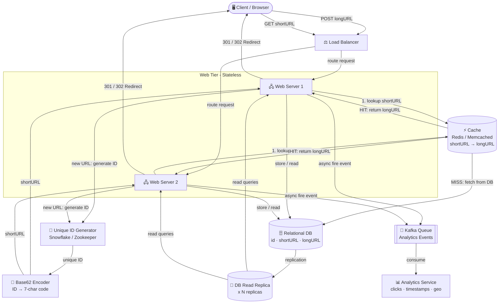

# THE URL SHORTNER
## Introduction
The URL shortener is a web application OR A mechanism that allows users to
 shorten long URLs into more manageable and short url
## Features
- Shorten long URLs: Users can input a long URL and receive a shortened version that redirects
- Custom aliases: Users can choose custom aliases for their shortened URLs, making them more memorable and easier to share.
- Analytics: The application can provide analytics on the usage of shortened URLs, such as the number visited data with timestamps
### The Async Part — This is the Critical Insight
```
User clicks
    │
    ▼
API receives request
    │
    ├──► Fire analytics to Kafka queue ──► (processed later, separately)
    │         └── does NOT block
    │
    ▼
Redirect user instantly
```
- Expiration: Users can set expiration dates for their shortened URLs, after which they will no longer be accessible.
## Usages
- Social Media: Users can share shortened URLs on social media platforms where character limits exist, such as Twitter.
- Marketing: Businesses can use URL shorteners in their marketing campaigns to track the effectiveness of their
- Non Digital marketing  like billboard,visiting cards,  newspapers 
- Link Management: Individuals and organizations can use URL shorteners to manage and organize their links more efficiently.

## step  1
#  Understand the problem and establish design scope
- Identify the core features and functionalities of the URL shortener.
- Define the target audience and use cases for the application.
- Determine the scalability requirements and expected traffic volume.
- Consider security and privacy implications, such as preventing abuse and ensuring data protection.
## step 2
# Back of envolop calculation
The Order to State Assumptions in Interview
1. Daily writes        → "100M URLs created per day"
2. Read/write ratio    → "10:1, so 1B reads per day"
3. Data retention      → "Store for 10 years"
4. Short code length   → "7 characters — let me verify this is enough"
## step 3
In this section, 
we discuss the API endpoints, 
URL redirecting, and 
URL shortening flows.
### API Endpoints
# Here we need two api end points because through the 
 -  POST -  we can write the   long URL into the shortern url  
 @ POST /api/v1/data/shorten
# what happen 
 @ Client → POST(long URL) → Server
   Server → returns short URL
   1.Client sends long URL

   2.Server:
   2.a-Generates short code
   2.b.Stores mapping (short → long)
    
   3.Server responds with short URL

2. GET → Redirect to original URL
  GET /api/v1/{shortUrl}

What happens:
1.User clicks or opens short URL
2.Browser sends GET request
Server:
Looks up long URL
Responds with HTTP redirect (301/302)
 #  the http redirec5t have some meaning.  why? -because 
- 301 Moved Permanently: Indicates that the resource has been permanently moved to a new  long URL. Search engines will update their indexes to reflect the new URL.
# while
- 302 Found (or Moved Temporarily): Indicates that the resource is temporarily located at a long URL. by this method every request go through the  shortnening service  and  it has advantage to store every request made by the user to perform the anlytics  
# advantages and disdvantages of 301 and 302
| Status Code | Advantages | Disadvantages |
|-301         |less load to services provider server |only have one time record of rediorection|
|302          |can track every request to short url |more load to services provider server|

## STEP 3
# Database Design OR wAY TO STORE DATA
# USING THE HASH FUNCTION 
- Hash the long URL to generate a unique short code.
- Store the mapping of short code to long URL in a database.
# we use the "hasing function +collision and  ecncoding 62 for the storing the long url and the sort url 


## Step 3 - Design Deep Dive Summary

- A relational DB stores `<id, shortURL, longURL>` — hash tables alone are too memory-expensive at scale.
- HashValue uses 62 chars `[0-9, a-z, A-Z]`; length 7 supports ~3.5 trillion URLs (enough for 365B).
- **Hash + Collision Resolution**: Take first 7 chars of CRC32/MD5/SHA-1; on collision, append a suffix and retry. Use bloom filters to avoid expensive DB lookups.
- **Base 62 Conversion**: Assign a unique auto-increment ID → convert to base-62 → that becomes the short code. No collision possible.
- Base 62 is preferred: simpler, no collision, but ID length grows over time and exposes sequence.
- URL Shortening flow: receive longURL → check DB → if exists return shortURL → else generate unique ID → base62 encode → store → return shortURL.
- URL Redirecting flow: click shortURL → load balancer → check cache → if hit return longURL → else fetch from DB → return longURL.
- Cache (`<shortURL, longURL>`) absorbs read-heavy traffic (reads >> writes).
- Extra considerations: rate limiting, stateless web tier scaling, DB replication/sharding, analytics, and CAP theorem trade-offs.

## Complete System Architecture



---

## Data Storage: Advantages, Disadvantages & Improvements

### 1. Hash Table (In-Memory)

| | Detail |
|---|---|
| ✅ Advantage | O(1) read/write, extremely fast |
| ✅ Advantage | No DB query overhead |
| ❌ Disadvantage | Memory is limited and expensive — not feasible at 365B URLs |
| ❌ Disadvantage | Data lost on server restart (not persistent) |
| ❌ Disadvantage | Cannot scale horizontally across multiple servers |

---

### 2. Hash + Collision Resolution (CRC32 / MD5 / SHA-1)

| | Detail |
|---|---|
| ✅ Advantage | Deterministic — same longURL always gives same shortURL |
| ✅ Advantage | No need for a separate ID generator |
| ❌ Disadvantage | Hash output is too long (CRC32 = 8 chars minimum), needs truncation |
| ❌ Disadvantage | Truncation causes collisions — requires recursive retry loop |
| ❌ Disadvantage | Every collision check = extra DB query → high latency under load |
| ❌ Disadvantage | Bloom filter helps but adds operational complexity |

---

### 3. Base 62 Conversion (Current Approach)

| | Detail |
|---|---|
| ✅ Advantage | No collision possible — unique ID guarantees unique short code |
| ✅ Advantage | Simple and predictable encoding/decoding |
| ✅ Advantage | 7 chars supports ~3.5 trillion URLs |
| ❌ Disadvantage | Exposes sequential IDs — attackers can enumerate all short URLs |
| ❌ Disadvantage | ID length grows as URL count grows |
| ❌ Disadvantage | Requires a distributed unique ID generator (complex in distributed systems) |

---

### 4. Relational DB (MySQL / PostgreSQL)

| | Detail |
|---|---|
| ✅ Advantage | ACID guarantees — no duplicate or lost mappings |
| ✅ Advantage | Easy to query, index on shortURL for O(log n) lookup |
| ✅ Advantage | Mature tooling for replication and backup |
| ❌ Disadvantage | Single primary node = write bottleneck at 100M writes/day |
| ❌ Disadvantage | JOIN-heavy analytics queries slow down the main DB |
| ❌ Disadvantage | Vertical scaling is expensive and has a hard ceiling |

---

## Possible Improvements

| Improvement | Why |
|---|---|
| **DB Sharding** | Split DB by shortURL hash range — distributes write load across nodes |
| **Read Replicas** | Route all GET (redirect) reads to replicas — primary only handles writes |
| **Cache (Redis)** | Absorbs ~80% of read traffic before it hits DB — massive latency reduction |
| **Bloom Filter** | Before DB lookup on write, check bloom filter to detect existing URLs without a full query |
| **Snowflake ID** | Replace simple auto-increment with Twitter Snowflake — globally unique, time-ordered, distributed-safe |
| **Randomise short code** | XOR or shuffle the base62 output to prevent sequential enumeration (security) |
| **Rate Limiter** | Block IP addresses sending too many shorten requests — prevents abuse |
| **Async Analytics** | Push click events to Kafka — never block the redirect path for analytics writes |
| **CDN for redirects** | Cache 301 redirects at CDN edge — user never hits origin server for popular URLs |
| **TTL / Expiry** | Add `expires_at` column — background job deletes expired rows, keeps DB lean |
